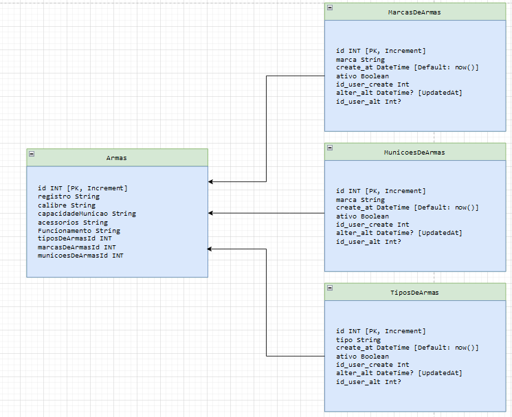

Almoxarifado

Este projeto é um sistema de cadastro de itens bélicos. Ele permite o gerenciamento e registro de informações relacionadas a armamentos.
Como usar

Siga as instruções abaixo para clonar e executar o projeto:

    git clone o repositório para sua máquina local.

git clone https://github.com/Reginaldolgj/API-cadastro-de-armas.git

    Navegue até o diretório do projeto.

cd API-cadastro-de-armas

    Instale as dependências do projeto usando o gerenciador de pacotes Yarn.

yarn

    Inicie o servidor de desenvolvimento.

yarn dev

Agora você pode acessar a API em http://localhost:3000 e começar a realizar as operações de cadastro de itens bélicos.

#Tecnologias utilizadas

O projeto foi desenvolvido utilizando as seguintes tecnologias:
    Node.js com TypeScript: Ambiente de execução e linguagem de programação.
    Express: Framework web para criação de APIs.
    Prisma: ORM (Object-Relational Mapping) para acesso ao banco de dados.
    Jest: Framework de testes.
    Zod: Biblioteca para validação de esquemas de dados.

#Banco de Dados

O projeto utiliza um banco de dados PostgreSQL. A imagem abaixo ilustra a estrutura do banco de dados utilizado.

#Testes

O projeto possui testes automatizados implementados com o framework Jest. Para executar os testes, utilize o seguinte comando:

yarn test

Você também pode gerar um relatório de cobertura de código executando o comando:

yarn coverage

Por favor, observe que ao executar os testes, a pasta do banco de dados PostgreSQL não será excluída, caso queria que exclua descomentar o código na pasta prisma-environment-jest.js conforme indicado no arquivo.

#Seed

O projeto possui um comando para popular o banco de dados com dados iniciais. Para executar o comando de seed, utilize o seguinte comando:

yarn seed
